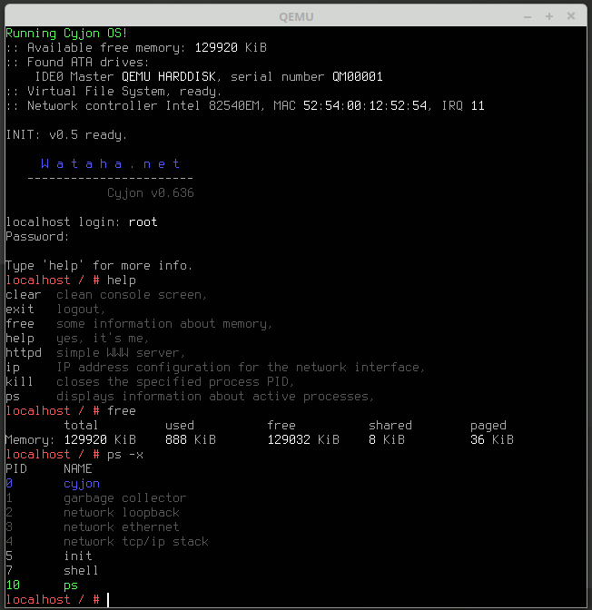

#Cyjon

A Simple multi-tasking system written in assembly language 

for the amd64/x86_64 processor family.

#Hardware Requirements:
- A amd64/x86_64 Processor
- 1 MiB physical RAM memory at address 0x0000000000100000,

#Software:
- Nasm Compiler v2.11.08+ (http://www.nasm.us/)
- Bochs Emulation Software v2.6.8+ 

(http://sourceforge.net/projects/bochs/files/bochs/),
- or QEMU Emulation Software v2.5.0+ 

(http://wiki.qemu.org/Main_Page),
- or VirtualBox Emulation Software v5.0.18+ 

(https://www.virtualbox.org/wiki/Downloads)

#Compilation from Terminal:

    GNU/Linux:
    Command "make"

#Startup:

    Configure Bochs and Virtualbox: set virtual disc "build/disk with omega.raw" as IDE0 Master.

    Configure qemu: "qemu-system-x86_64 -hda "build/disk with omega.raw""

#Uwagi:
Emulators on Microsoft Windows may not handle the arrow/cursor keys properly. Neither I nor akasei are responsible for this. It is an issue with the emulation software.

#Credit:
If you have applied a patch, upgraded, or implemented something completely new in the source system, add yourself to the group of developers at http://wataha.net!

- Andrzej Adamczyk, akasei
- Darek Kwieciński, devport

#License:
Source code in licensed under Creative Commons BY-NC-ND 4.0

![alt tag]
(http://mirrors.creativecommons.org/presskit/buttons/80x15/png/by-nc-nd.png)
